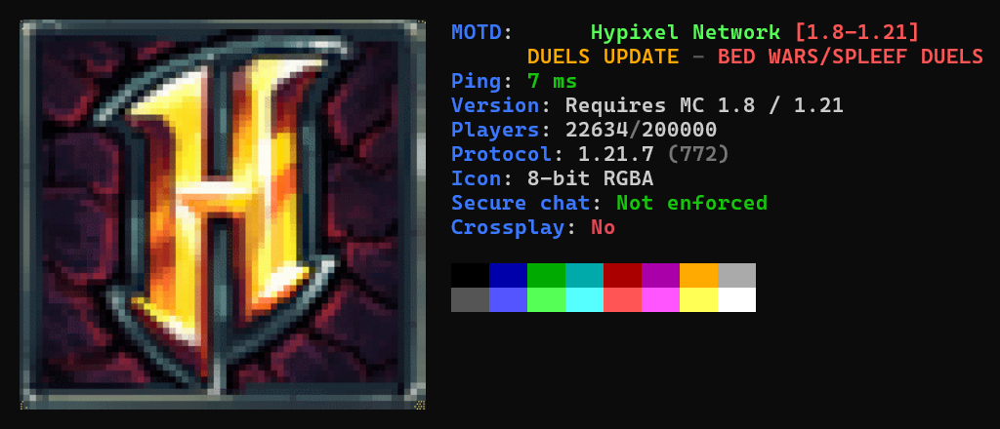

# Minefetch

Minefetch is a neofetch-like tool for fetching Minecraft server information.



## Install

### Script

#### Unix-like (Linux and macOS)

```sh
curl -fsSL https://raw.githubusercontent.com/bhavjitChauhan/minefetch/main/install.sh | sh
```

#### Windows

```ps1
powershell -c "iwr https://raw.githubusercontent.com/bhavjitChauhan/minefetch/main/install.ps1 | iex"
```

### Go

If you have Go installed, you can use the `go install` command:

```sh
go install github.com/bhavjitChauhan/minefetch@latest
```

### Manual

To install an older version, or if the above methods do not work,
you can manually download a prebuilt binary from the
[GitHub releases](https://github.com/bhavjitChauhan/minefetch/releases) page.

## Usage

Run against a Java Edition server:

```sh
minefetch hypixel.net
```

Run against a Bedrock Edition server:

```sh
minefetch --bedrock play.lbsg.net
```

View all available options:

```sh
minefetch --help
```

## Features

- [x] Java Edition
- [x] Bedrock Edition (`--bedrock`)
- [x] Server icon
- [x] RGB text
- [x] Crossplay
- [x] Cracked servers (`--cracked`)
- [x] Mojang's blocked server list (`--blocked`)
- [x] Query (`--query`)
- [x] RCON (`--rcon`)
- [x] Chat report prevention
- [x] SRV lookup
- [x] Raw output (`--output raw`)

## Internal packages

This project has no third-party dependencies, including Go's X-Repositories.
This is not as impressive as it may sound, as Go's standard library is quite extensive.
It does, however, mean that many wheels have been reinvented in the [internal](internal) directory.
These include:

- `mc`: Subset of the Java Edition protocol
- `mcpe`: Subset of the Raknet protocol as used by Bedrock Edition
- `term`: Terminal syscalls, and ANSI and xterm escape codes
- `image/`
    - `sixel`: Sixel encoding
    - `scale`: Lanczos image scaling
    - `quant`: Median-cut image quantization
    - `pngconfig`: PNG header decoding
    - `print`: Terminal image rendering via Unicode
- `flag`: CLI flag parsing
- `emoji`: Emoji detection and manipulation

These packages should only be used for reference purposes.
They are not intended for public use, and may break at any time.

## Inspiration

This project was influenced by:

- [neofetch](https://github.com/dylanaraps/neofetch)
- [mcstatus.io](https://mcstatus.io)
- [mcsrvstat.us](https://mcsrvstat.us)
